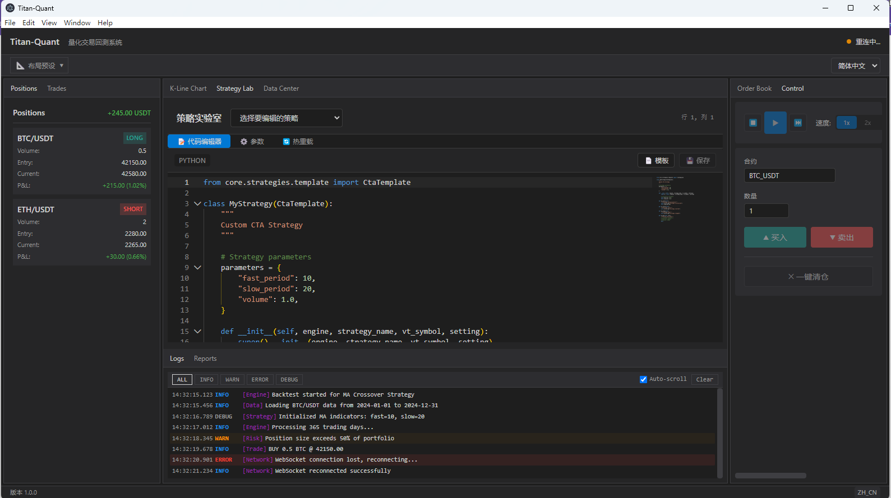
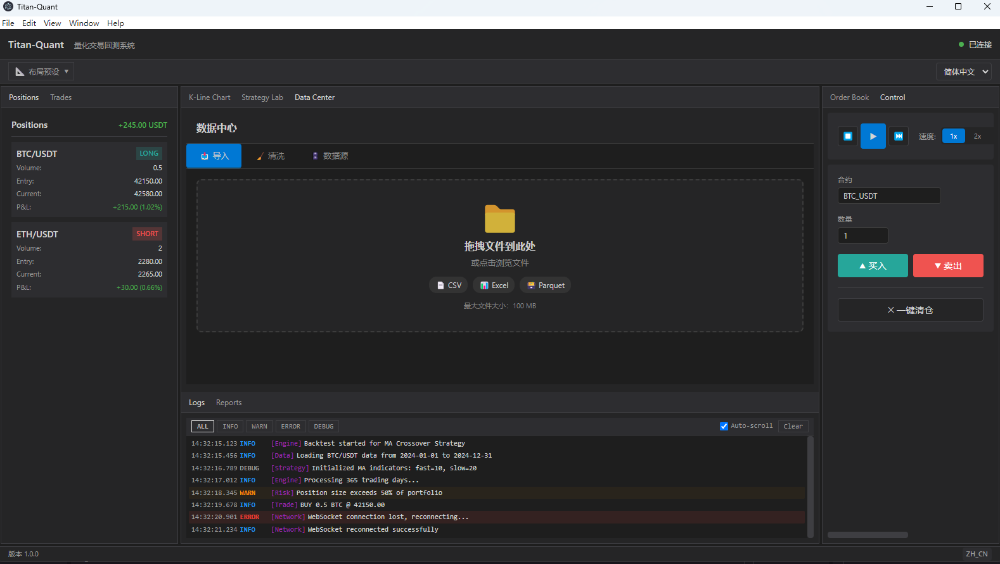

# Titan-Quant

<div align="center">


**工程级量化交易回测系统**

[](https://opensource.org/licenses/MIT)
[](https://www.python.org/downloads/)
[](https://www.typescriptlang.org/)
[](https://www.electronjs.org/)

[English](README_EN.md) | 简体中文

</div>

---

## 📖 简介

Titan-Quant 是一个专业级量化交易回测系统，采用守护进程+GUI客户端分离架构。系统提供完整的回测、策略开发、数据管理和风险控制功能，适合个人量化交易者和小型团队使用。

## ✨ 特性

### 核心功能
- **🚀 事件驱动架构**: 高性能回测引擎，保证事件顺序确定性
- **📊 L1/L2 撮合**: 支持多种撮合模式，L2 模式声明模拟等级
- **🔄 策略热重载**: 支持 RESET/PRESERVE/SELECTIVE 三种重载策略
- **🛡️ 完整风控**: 自动熔断机制，保护资金安全
- **📝 审计日志**: 链式哈希校验，不可篡改
- **📈 类 TradingView UI**: 专业 K 线图和多窗口布局

### 界面功能
- **K线图表**: 基于 Lightweight-charts，支持多种技术指标
- **策略实验室**: Monaco Editor 代码编辑器，支持 Python 语法高亮
- **数据中心**: 支持 CSV/Excel/Parquet 数据导入和清洗
- **订单簿**: 实时深度图显示，支持垂直/水平/组合视图
- **回测报告**: 交互式 HTML 报告，包含夏普比率、最大回撤等指标

## 🖼️ 界面预览

<div align="center">

### K线图表 & 持仓管理


*实时 K 线图表 · 持仓盈亏追踪 · 订单簿深度图 · 手动交易面板*

---

### 策略实验室 & 日志系统


*Monaco 代码编辑器 · Python 策略开发 · 实时日志监控 · 多级别日志过滤*

</div>

## 📁 项目结构

```
titan-quant/
├── bin/                    # 启动脚本
├── config/                 # 配置文件
│   ├── i18n/              # 国际化语言包
│   ├── system_setting.yaml
│   └── risk_control.yaml
├── core/                   # 核心引擎
│   ├── engine/            # 事件总线、撮合引擎等
│   │   └── adapters/      # 引擎适配器
│   ├── data/              # 数据治理
│   │   └── providers/     # 数据源插件
│   └── strategies/        # 策略管理
├── database/              # 数据存储
│   ├── ticks/            # Tick 数据
│   ├── bars/             # K 线数据
│   └── cache/            # 缓存
├── logs/                  # 日志文件
├── reports/               # 回测报告
├── strategies/            # 用户策略
├── ui/                    # Electron + React 前端
│   ├── src/
│   │   ├── main/         # Electron 主进程
│   │   └── renderer/     # React 渲染进程
│   └── package.json
├── tests/                 # 测试文件
└── utils/                 # 工具模块
```

## 🚀 快速开始

### 环境要求

- Python 3.10+
- Node.js 18+
- npm 或 yarn

### 安装

```bash
# 克隆仓库
git clone https://github.com/yourusername/titan-quant.git
cd titan-quant

# 创建 Python 虚拟环境
python -m venv venv
source venv/bin/activate  # Linux/Mac
# 或 venv\Scripts\activate  # Windows

# 安装 Python 依赖
pip install -r requirements.txt

# 安装前端依赖
cd ui
npm install
```

### 运行

```bash
# 方式一：使用启动脚本 (推荐)
# Windows
bin\start_server.bat

# Linux/Mac
./bin/start_server.sh

# 方式二：手动启动
# 终端 1 - 启动后端服务
python -m core --debug

# 终端 2 - 启动前端
cd ui
npm run dev

# 终端 3 - 启动 Electron
cd ui
npm run start
```

### 打包发布

```bash
cd ui

# Windows
npm run build:win

# macOS
npm run build:mac

# Linux
npm run build:linux
```

## 🛠️ 技术栈

### 后端
- **Python 3.10+** - 核心语言
- **WebSocket** - 实时通信
- **Polars** - 高性能数据处理
- **TA-Lib** - 技术指标计算
- **Optuna** - 参数优化

### 前端
- **Electron 28** - 桌面应用框架
- **React 18** - UI 框架
- **TypeScript 5** - 类型安全
- **Lightweight-charts** - K线图表
- **Monaco Editor** - 代码编辑器
- **Zustand** - 状态管理
- **i18next** - 国际化

### 数据存储
- **SQLite** - 元数据存储
- **Parquet** - 行情数据存储

### 测试
- **pytest** - Python 单元测试
- **hypothesis** - 属性测试
- **Jest** - JavaScript 测试

## 📚 文档

- [用户指南](docs/user-guide.md)
- [开发文档](docs/development.md)
- [API 参考](docs/api-reference.md)
- [策略开发](docs/strategy-development.md)

## 🤝 贡献

欢迎提交 Issue 和 Pull Request！

1. Fork 本仓库
2. 创建特性分支 (`git checkout -b feature/AmazingFeature`)
3. 提交更改 (`git commit -m 'Add some AmazingFeature'`)
4. 推送到分支 (`git push origin feature/AmazingFeature`)
5. 提交 Pull Request

## 📄 许可证

本项目采用 MIT 许可证 - 查看 [LICENSE](LICENSE) 文件了解详情。

## 🙏 致谢

- [VeighNa](https://www.vnpy.com/) - 量化交易框架
- [Lightweight-charts](https://tradingview.github.io/lightweight-charts/) - 图表库
- [Monaco Editor](https://microsoft.github.io/monaco-editor/) - 代码编辑器

---

<div align="center">

**如果这个项目对你有帮助，请给一个 ⭐ Star！**

</div>
